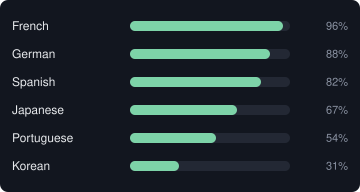

# crowdin-stats

Self-hosted service generating live, embeddable SVG images (translation
progress table + contributor grid) for Crowdin projects, for use in GitHub
READMEs. See `PLAN.md` for the full design and `SECURITY.md` for the
encryption/token-handling guarantees.

<p>
  
  
  
</p>

## Development

```bash
go build ./...
go test ./...

# regenerate landing-page demo SVGs after changing render.go
go run ./cmd/crowdin-stats gendemo

# rebuild compiled CSS after changing input.css or static/*.html
npx tailwindcss -i input.css -o static/app.css --minify
```

## Running locally

```bash
export MASTER_KEY=$(openssl rand -base64 32)
export DB_PATH=./data/db.sqlite
export HOST=localhost:8080
go run ./cmd/crowdin-stats

# add -no-cache to bypass the 12h embed cache entirely — every embed
# request does a live Crowdin fetch, useful while testing
go run ./cmd/crowdin-stats -no-cache
```

## Deployment

See `docker-compose.yml`, `Dockerfile`, and `Caddyfile`. Copy `.env.example`
to `.env`, fill in `MASTER_KEY` and `HOST`, then `docker compose up -d --build`.

## License

Apache License 2.0 — see [LICENSE](LICENSE).
